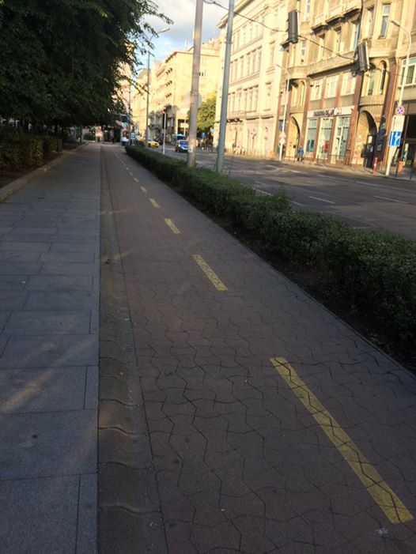
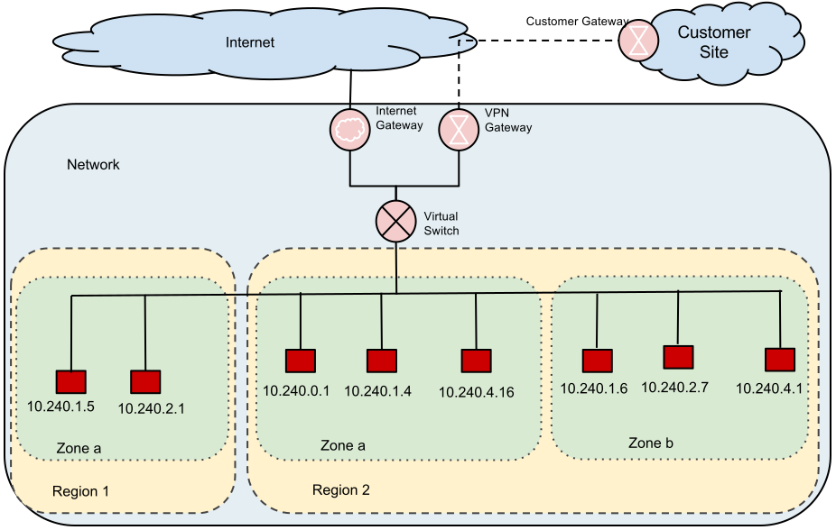
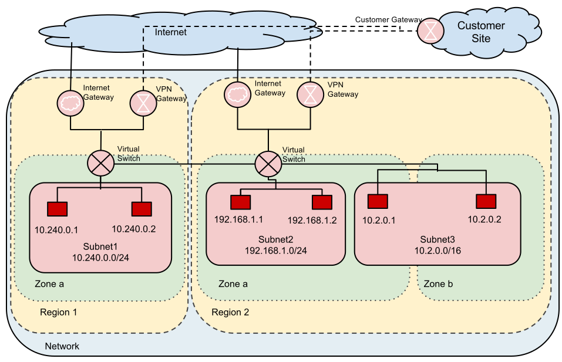
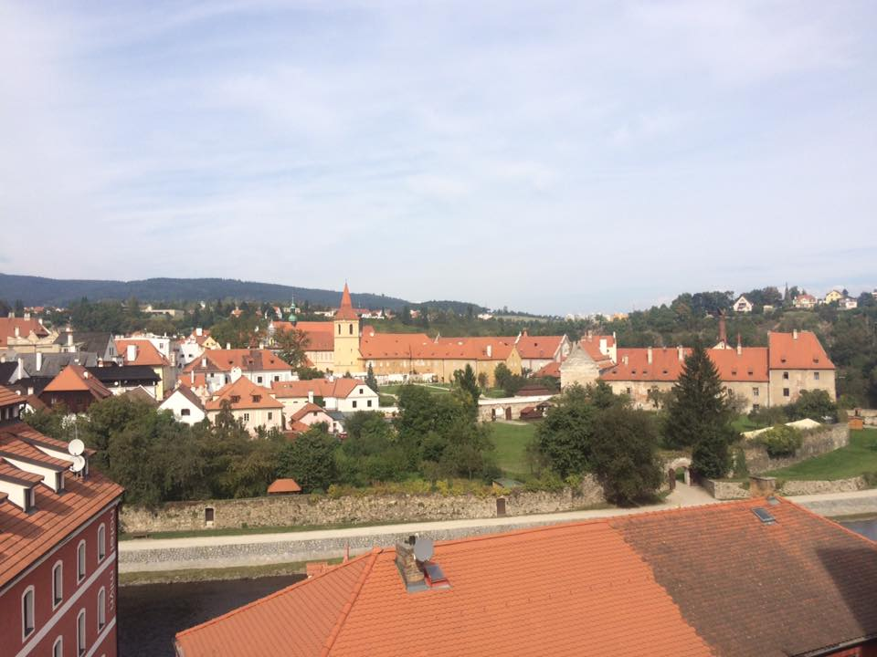
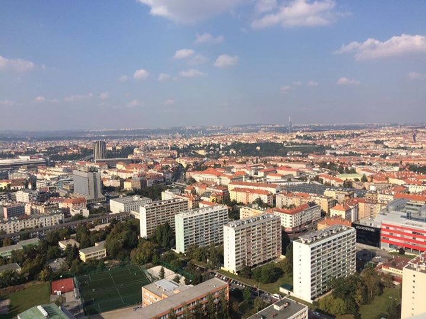

# Google Cloud Platformでのネットワーク構成

---

## 自己紹介

Name: MisaKondo
GitHub: https://github.com/MisaKondo
@: M.T.Burn 2016/10/01~


---

# 今回はGCPのネットワーク構成について

GCPでは当初、今ではLegacy Network呼ばれるnetworkのみの構成
とはいえ、Legacy Networkとは何かと言われても、普段意識しない部分

---

# 構成にはいろいろな道がある

---


---


---



---

普段意識しない部分ですが、つい先日(2016/10/04)にofficialから、素晴らしい記事が紹介されました

[一から学べる Google Cloud Networking リファレンス ガイド](http://googlecloudplatform-japan.blogspot.jp/2016/10/google-cloud-networking_4.html)

---

正直、これを読めば今回の発表いらないよね、とも思ったのですが、前述した通り、普段意識しない部分でもあります。
このため、意識しないでインスタンスを作成した場合とそうでない場合ににについて、お話します。

---

# まずは、GCP上のNetworkの二種類をご紹介

---

# Legacy Networkと呼ばれているもの



---

# Subnet Networkと呼ばれているもの



---

# defaultではSubnet Networkが利用される

---

## default(最初から用意されているNetwork)には、subnetがすでに用意されている

```
# Networks
gcloud compute networks list
NAME           MODE    IPV4_RANGE  GATEWAY_IPV4
default        auto

# subnets
gcloud compute networks subnets list
NAME                REGION        NETWORK        RANGE
default             asia-east1    default        10.140.0.0/20
default             us-west1      default        10.138.0.0/20
default             us-central1   default        10.128.0.0/20
default             europe-west1  default        10.132.0.0/20
default             us-east1      default        10.142.0.0/20
```

---

## default(最初から用意されているnetwork)には、firewall rulesがすでに用意されている

```
gcloud compute firewall-rules list
NAME                                NETWORK        SRC_RANGES    RULES                         SRC_TAGS          TARGET_TAGS
default-allow-icmp                  default        0.0.0.0/0     icmp
default-allow-internal              default        10.128.0.0/9  tcp:0-65535,udp:0-65535,icmp
default-allow-rdp                   default        0.0.0.0/0     tcp:3389
default-allow-ssh                   default        0.0.0.0/0     tcp:22
```

---

# ここまでの注意点

- subnetはregion単位（zoneはまたげるが、regionはまたげない)
- Legacyでも同じだが、firewall ruleを指定することによって通信が可能となっている（逆に言うと、何もruleが作られてないないとsshとかできない）

---

# デモ

- 環境が不安定だったりしたら、デモじゃなくてスライドに変わるかも知れないです

---

# default Subnet Network上でinstanceを作成

```
# US
gcloud compute instances create default-us --image-family centos-6 --image-project centos-cloud \
--machine-type n1-standard- 1 --zone us-central1-f --subnet default --description 'Sample of Dev Fest' \
--boot-disk-device-name default-us --boot-disk-size 10GB --boot-disk-type pd-ssd --tags default --preemptible

# ASIA
gcloud compute instances create default-asia --image-family centos-6 --image-project centos-cloud \
--machine-type n1-standard-1 --zone asia-east1-c --subnet default --description 'Sample of Dev Fest' \
--boot-disk-device-name default-asia --boot-disk-size 10GB --boot-disk-type pd-ssd --tags default ---preemptible
```

---

# defaultで用意されたfirewall ruleが割り当てられるので、regionまたいでも(当然zoneをまたいでも通信できる)

```
# US
gcloud compute --project mass-dev-fest ssh --zone us-central1-f default-us

# ASIA
gcloud compute --project mass-dev-fest ssh --zone asia-east1-c default-asia
```

---

# custom Subnet Networkを自前で作成した場合

- not defaultが好きなあなたに

---

##  Subnet Network作成

```
gcloud compute networks create subnetnetwork --mode custom --description GlobalOfProjectNetwork
```

---

## subnet作成（asia subnetとus subnet)

```
gcloud compute networks subnets create devfest-us-central --description DevFestUSNetwork --network subnetnetwork --region us-central1 --range 10.10.0.0/16
gcloud compute networks subnets create devfest-asia-east --description DevFestASIANetwork--network subnetnetwork --region asia-east1 --range 10.11.0.0/16
```

---

## 各subnetに所属するinstanceを作成、する前にinstanceが外と通信するためのfirewallを設定します

```
gcloud compute firewall-rules create all-allow-icmp-service \
--allow icmp --description icmp --network subnetnetwork --target-tags icmp --source-ranges 0.0.0.0/0
gcloud compute firewall-rules create devfest-internal-allow-tcp-service \
--allow tcp:1-65535 --description internal-tcp --network subnetnetwork --target-tags devfest-resource  --source-tags devfest-resource
gcloud compute firewall-rules create devfest-internal-allow-udp-service \
--allow udp:1-65535 --description internal-udp --network subnetnetwork --target-tags devfest-resource  --source-tags devfest-resource
```

---

## 各subnetに所属するinstanceを作成

```
# US
gcloud compute instances create custom-us --image-family centos-6 --image-project centos-cloud \
--machine-type n1-standard-1 --zone us-central1-f --subnet devfest-us-central --description 'Sample of Dev Fest' \
--boot-disk-device-name custom-us --boot-disk-size 10GB --boot-disk-type pd-ssd --tags ssh,icmp,devfest-resource \
--preemptible

# ASIA
gcloud compute instances create custom-asia --image-family centos-6 --image-project centos-cloud \
--machine-type n1-standard-1 --zone asia-east1-c --subnet devfest-asia-eastl --description 'Sample of Dev Fest' \
--boot-disk-device-name custom-asia --boot-disk-size 10GB --boot-disk-type pd-ssd --tags ssh,icmp,devfest-resource \
--preemptible
```

---

# 現状の接続

```
# US
gcloud compute --project mass-dev-fest ssh --zone us-central1-f custom-us
# ASIA
gcloud compute --project mass-dev-fest ssh --zone asia-east1-c custom-asia
```

---

## SSH用のfirewall ruleを追加

```
gcloud compute firewall-rules create all-allow-ssh-service \
--allow tcp:22 --description ssh --network subnetnetwork --target-tags ssh --source-ranges 0.0.0.0/0
```

---

# 今の接続

```
gcloud compute --project mass-dev-fest ssh --zone us-central1-f custom-us
gcloud compute --project mass-dev-fest ssh --zone asia-east1-c custom-asia
```

---

defaultとの違いって何？(笑)=Customを利用したい理由って？

- rangeが明示的に指定できる
- subnetも明示的に指定できる
- defaultのリソースが邪魔なあなたに

---

# Legacy と Subnet だと、Subnetを利用した方が良い？

名前からすると明らかに後者を選ぶべき、となりそうだが、優位点はさほどない。
個人の所感としては、前者の方がより先進的、後者の方は他Cloudとの互換を意識して作ったのではないかと邪推。

実際のところ、Subnet Networkでも既存のfirewall-rulesを利用するならほとんどLegacyと変わらない。
このため、Subnetを利用した方が良いというよりは、特にこだわりないならdefaultのSubnet Networkを利用すればいい。

---

# とはいえ、じゃあSubnetを利用する理由ってなに？

---

# GCPの世界だけで完結した場合のLegacy/Subnet Network



---

- 知る範囲では、Subnetを利用するメリットをあげるのは難しい
- 必要のない障壁なら作らなくていい、あえて最初から障壁のある環境に身を置くのは不自由なので、GCPの世界だけならLegacy使えばいいのでは
- とはいえあえてLegacyを指定する手間をかけるなら、意識せずにdefaultのSubnet Networkを利用すればいい

---

# 別世界と繋がった場合のLegacy/Subnet Network



---

- GCPの外の世界（オンプレミスorAWS)を意識した場合にSubnetが有用、かもしれない
- GCPの中ではinstance別にtagで管理するfirewall-rulesだが、外の世界ではそうでもなかったり
- この時、特定のsubnetを指定できているのは嬉しい。subnet maskで許可設定しておける、例:SecurityGroup

---

# まとめ

- SubnetとLegacyでどちらが優れたNetworkかというと、できることに違いはない(と思う)
- Subnet Networkは、subnet単位でrouting tableを持つわけではない
- 特に込み入った事情がないなら、悩まずにdefault使えばいいんじゃないかと思う
- 他の世界とやり取りするならCustomがいいかも
